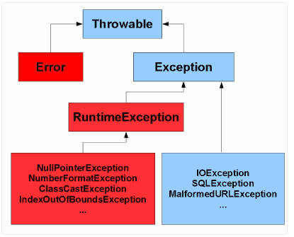

# Controle de Fluxo - Desafio
Vamos exercitar todo o conteúdo apresentado no módulo de Controle de Fluxo codificando o seguinte cenário.

O sistema deverá receber dois parâmetros via terminal que representarão dois números inteiros, com estes dois números você deverá obter a quantidade de interações (for) e realizar a impressão no console (System.out.print) dos números incrementados, exemplo:

- Se você passar os números 12 e 30, logo teremos uma interação (for) com 18 ocorrências para imprimir os números, exemplo: "Imprimindo o número 1", "Imprimindo o número 2" e assim por diante.
- Se o primeiro parâmetro for MAIOR que o segundo parâmetro, você deverá lançar a exceção customizada chamada de ParametrosInvalidosException com a segunda mensagem: "O segundo parâmetro deve ser maior que o primeiro"
1. Crie o projeto DesafioControleFluxo
2. Dentro do projeto, crie a classe Contador.java para realizar toda a codificação do nosso programa.
3. Dentro do projeto, crie a classe ParametrosInvalidosException que representará a exceção de negócio no sistema.

------
## Aprendizados
1. Tratamento de Exceções

